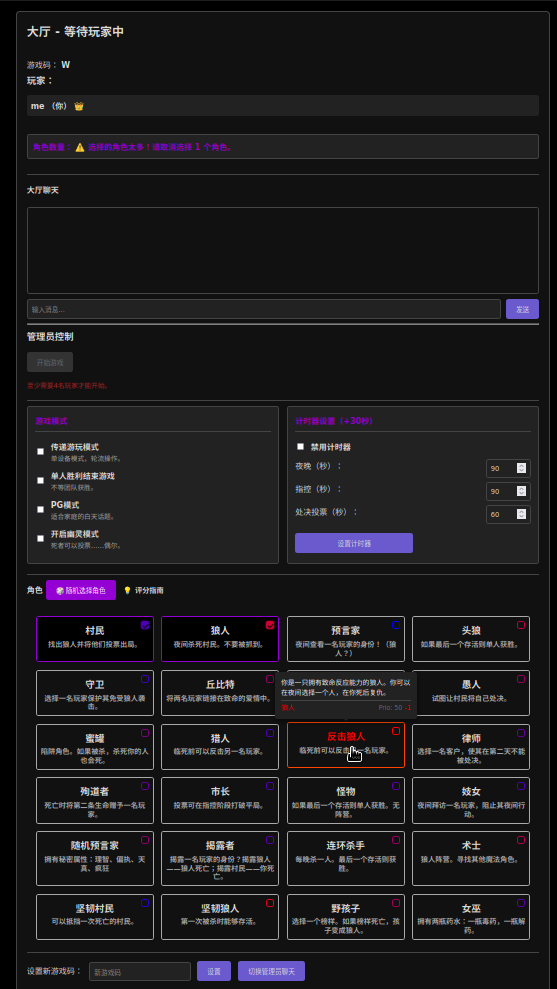
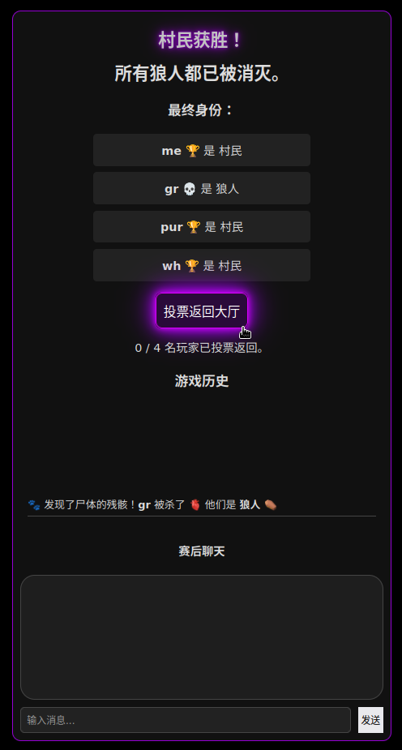
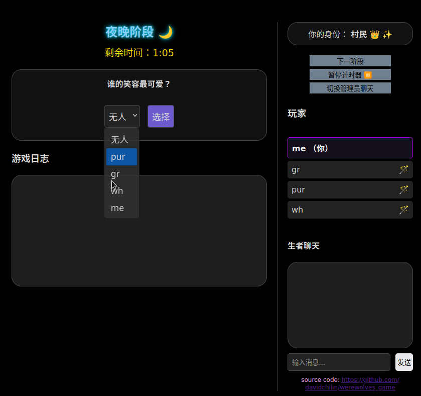
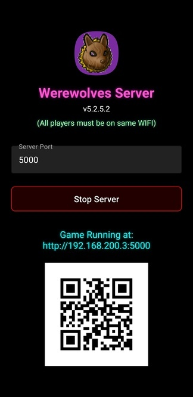

[🇺🇸 English](README.md) | [🇬🇹 Español](README.es.md) |
[🇩🇪 Deutsch](README.de.md)
<a href="https://f-droid.org/packages/io.github.davidchilin.werewolves_game/"></a>
<a href="https://apt.izzysoft.de/fdroid/index/apk/io.github.davidchilin.werewolves_game?repo=main"></a>
<a href="https://github.com/davidchilin/werewolves_game/releases"></a>


一款自托管的多人社交推理游戏（只需一个人运行应用）。使用 Python
(Flask) 和 WebSocket 构建，支持
**24 种独特角色**、**无需主持人**、手机"轮流玩"模式、多语言同步、以及自动化的投票和死亡逻辑。

[安装说明](#搭建与运行) 或在
[Releases](https://github.com/davidchilin/werewolves_game/releases)
下载服务端应用（[Android/APK](https://github.com/davidchilin/werewolves_game/releases)
和 Linux/x86）。

## **简介**

本应用是经典派对游戏 _狼人杀_
的 Web 实现。玩家（最少 4 人，建议 7 人以上）使用独特的游戏码加入房间，秘密分配角色（村民、狼人、预言家……），然后循环"夜晚"和"白天"阶段。夜晚狼人秘密选择要淘汰的玩家，预言家可以调查玩家的身份。白天玩家讨论并投票处决他们怀疑的狼人。游戏支持复杂的交互：丘比特连接的爱侣、连锁死亡（蜜罐/猎人）、单人获胜角色（连环杀手/愚人），以及死者仍可影响游戏结果的"幽灵模式"。

游戏设计为配合独立的视频或语音聊天（如 Jitsi Meet 或 Zoom）进行 **或者**
面对面使用一台到几台设备以**轮流玩**模式进行。

## **核心功能**



- **📱 轮流玩模式：**
  使用一台手机（或多台）在房间里传递。界面会引导玩家确认身份后再显示私密角色界面。
- **👻 幽灵模式：**
  死去的玩家不仅仅是旁观者。启用后，幽灵在指控和处决投票阶段有较小概率参与。
- **🎭 24 种独特角色：**
  包括复杂的角色如**头狼**、**妓女**、**律师**和**连环杀手**。
- **シ 多语言支持：** 同一局游戏中不同玩家可同时使用不同语言。
- **🏆 单人胜利条件：**
  中立角色如**怪物**、**愚人**或**疯狂村民**可以单独获胜，无视团队归属。

- **强大的管理员控制：** 第一个加入游戏的玩家成为管理员，可以：
  - 从房间踢出玩家
  - 当足够玩家加入后开始游戏（最少 4 人）
  - 设置夜晚、指控和处决投票阶段的自定义计时器时长（秒）
  - 设置新的游戏码
  - 设置仅管理员聊天
  - 开启**轮流玩模式**、**幽灵模式**、**单人获胜**
  - 转让**管理员**状态
- **持久会话：**
  玩家可以刷新浏览器或短暂断线而不会丢失游戏位置（虽然计时器可能不准）
- **实时游戏更新与聊天：**
  界面通过 WebSocket 实时更新，显示阶段变化、玩家状态、游戏聊天和游戏日志事件。
- **动态角色分配：** 游戏开始时，角色被随机秘密分配给玩家。
  - "随机角色"按钮根据角色权重（正面为村民阵营，负面为狼人阵营）计算平衡配置。
- **自动化游戏循环与胜利条件：**
  游戏自动循环阶段。每次死亡后（狼人猎杀、处决投票），系统检查胜利条件：
  - **村民胜利：** 所有狼人被淘汰。
  - **狼人胜利：** 存活狼人数量大于或等于存活非狼人数量。
  - **🏆 单人胜利条件：**
    中立角色如**怪物**、**愚人**或**疯狂村民**可以单独获胜。
  - 当达到胜利条件时，所有玩家显示"游戏结束"界面，显示获胜队伍、胜利原因以及所有玩家及其最终角色列表。

## **游戏阶段**



- **夜晚阶段：**

  - 阶段在计时器结束 **或者** 所有狼人和预言家提交行动后结束。
  - 夜间行动完成后，游戏在进入指控阶段前检查是否达到胜利条件。

- **指控阶段：**

  - 阶段在计时器结束 **或者** 所有存活玩家完成指控后结束。
  - 存活玩家投票指控一人。
  - 幽灵有 25% 概率参与指控。
  - 每个玩家名字旁边实时显示指控计数。
  - 平局规则：如果被指控最多的玩家出现平局：
    - 如果只有两人平局，不进行处决投票。
    - 如果超过两人平局，指控阶段重新开始一次。第二次平局则不进行处决投票。

- **处决投票阶段：**

  - 如果某位玩家被指控最多，则进入审判。
  - 阶段在计时器结束 **或者** 所有存活玩家投票后结束。
  - 存活玩家投票"是"或"否"处决被指控玩家。需要多数"是"票。幽灵有 10% 概率在处决投票中投票。
  - 如果计时器到期，未投票的玩家默认投"否"。
  - 谁投了"是"和"否"的详细摘要显示在游戏日志中。
  - 投票后，游戏在进入夜晚前检查是否达到胜利条件。

- **一般白天阶段行动：**
  存活玩家可以讨论谁是狼人，并可投票提前结束白天阶段（至少 30 秒）并开始指控过程。狼人必须在白天阶段公开协调，不要显得太可疑。如果多数选择入睡，游戏进入夜晚。

## **角色**

游戏目前支持 **24 种独特角色**：

### 🌻 村庄阵营

- **村民：** 无特殊能力。必须团结合作，找出并消灭所有狼人。
- **预言家 / 随机预言家：** 每晚调查一名玩家的身份。
- **守卫：** 每晚保护一名玩家免受狼人杀害。
- **女巫：** 拥有一瓶**解药**和一瓶**毒药**。
- **猎人：** 如果被杀，可以射杀一名目标。
- **丘比特：** 链接两名爱侣。如果一人死亡，另一人也死。
- **市长：** 投票具有平局决胜权。可以指定继任者。
- **妓女：** 通过拜访来阻止一名玩家的能力。
- **律师：** 使客户在第二天免疫处决。
- **揭露者：** 可以立即杀死狼人，但如果揭露的是村民则自己死亡。
- **殉道者：** 死亡时将"第二条命"（护甲）赠予某人。
- **坚韧村民：** 第一次被杀时存活。
- **野孩子：** 选择一个榜样。如果榜样死亡，变成狼人。

### 🐺 狼人阵营

- **狼人：** 必须与其他狼人合作消灭村民，直到获得多数优势。
- **头狼：** 只有成为最后的狼人才能获胜。
- **反击狼人：** 一种像猎人一样反击的狼人。
- **坚韧狼人：** 有护甲的狼人（抵挡一次攻击）。
- **术士：** 与狼人合作。可以找到预言家/女巫但不能杀人。

### 🎭 中立与单人（混乱）

- **连环杀手：** 每晚杀人。最后一个存活则获胜。
- **愚人：** 让自己被处决则获胜。
- **疯狂村民：** 显示为好人，但如果村庄被摧毁则获胜。
- **怪物：** 免疫狼人攻击。如果与 1 只狼人单独存活则获胜。
- **蜜罐：** 如果被杀，杀死蜜罐的人也会死（复仇）。



## **搭建与运行**

要在本地运行此项目，请按以下步骤操作：

1.  **克隆仓库：**

    ```bash
    git clone https://github.com/davidchilin/werewolves_game.git
    cd werewolves_game
    ```

    或下载 werewolves_game-master.zip 并解压到 werewolves_game 文件夹。

2.  **编辑** `.env.werewolves` 文件。将 _FLASK_SECRET_KEY_ 改为 _长随机串_，将
    _CORS_ALLOWED_ORIGINS_ 改为游戏访问地址，如：
    http://127.0.0.1:5000,http://your.ip.here:5000,https://your.site.here:5000
    或留空以禁用 CORS。

3.  **选择** 通过 Dockerfile 运行（步骤 3A & 5）**或**
    通过 docker-compose 运行（步骤 3B & 5）**或** 本地安装运行（步骤 3C-5）。

    A. 构建 Docker 并运行。例如将浏览器端口改为 8080：-p 8080:5000。

    ```bash
    docker build -t werewolves_game -f dockerfiles/Dockerfile .
    docker run -p 5000:5000 --name werewolves_game werewolves_game
    ```

    B. 构建 Docker Compose 并运行。

    ```bash
    docker compose -f dockerfiles/docker-compose.yml up --build
    docker compose -f dockerfiles/docker-compose.yml up
    ```

    Nginx Docker Compose 版本：编辑 `.env.werewolves`
    文件：NGINX_PORT 为所需端口（默认 5000）并修改 nginx.conf 中的 server_name。

    ```bash
    docker compose -f dockerfiles/docker-compose-nginx.yml up --build
    docker compose -f dockerfiles/docker-compose-nginx.yml up
    ```

    C. 创建并激活虚拟环境：

    - Windows：

      ```bash
      python -m venv venv
      .\venv\Scripts\activate
      ```

    - macOS / Linux：
      ```bash
      python3 -m venv venv
      source venv/bin/activate
      ```

4.  **安装依赖：**

    ```bash
    pip install Flask Flask-SocketIO python-dotenv
    ```

5.  **运行应用：**

    ```bash
    FLASK_APP=app.py flask run -h 0.0.0.0
    ```

    或者使用 gunicorn 运行以获得更好的性能和安全性：

    ```bash
    pip install gunicorn gevent
    export GAME_PORT=5001
    gunicorn --worker-class gevent -w 1 -b 0.0.0.0:$GAME_PORT app:app
    ```

    如果使用 LetsEncrypt SSL，可以通过 SSL 部署 gunicorn，并用 `deploy_certs.sh`
    复制证书，同时更新 `.env.werewolves` 中的 `USE_HTTPS=true`：

    ```bash
    sudo ./deploy_certs.sh cpu_user_name my.site.com
    export GAME_PORT=5001
    gunicorn --worker-class gevent -w 1 -b 0.0.0.0:$GAME_PORT   --certfile=./ssl_certs/fullchain.pem   --keyfile=./ssl_certs/privkey.pem   app:app
    ```

6.  **访问游戏：** 打开浏览器，访问 `.env.werewolves` 中 `CORS_ALLOWED_ORIGINS`
    设置的地址。默认：`http://127.0.0.1:5000`。打开多个标签页或浏览器模拟不同玩家加入游戏。初始游戏码为
    `W`，第一个加入的玩家为**管理员**。

### 游戏配置（config.py）

- DEFAULT_CODE：设置初始默认游戏码，通常为 `W`，不区分大小写。
- DEFAULT_LANGUAGE：设置为 "zh" 改变服务器默认语言。
- TIME_NIGHT / TIME_ACCUSATION：更改默认时长（秒）。
- PAUSE_DURATION：阶段间暂停秒数（用于阅读文本）。
- DEFAULT_ROLES：哪些角色在启动时默认选中。

### 添加自定义角色



1. roles.py：创建继承自 Role 的类。定义 team、night_action 等。
2. app.py：导入新角色并添加到 AVAILABLE_ROLES 字典。
3. static/game.js：添加角色键（const）并更新 updateRoleTooltip 的颜色/图标。
4. static/zh.json（及其他语言文件）：在 "roles" 对象中添加名称和描述。

### 添加本地化 / 语言翻译

要添加新语言，需要添加语言文件（例如 `static/fr.json`），并编辑
`templates/index.html`（添加 `option value`
和 loginTranslations）。并将 “fr” 添加到 app.py
`for lang in ["en", "es", "fr"]:` 。奖励：为 F-Droid 添加 fastlane 文档。

### Android 应用

查看
[Releases](https://github.com/davidchilin/werewolves_game/releases)，使用 GitHub
Actions 自动构建！确保所有玩家在同一 WIFI 下。在 Android
Studio 中构建所需的所有文件都在 **android**
文件夹中。将 werewolves_game 的 python、static、templates、img 移入
`android/app/src/main/python/`。

### 许可证

根据 GNU GPL v3 许可证分发。详见 [LICENSE](LICENSE)。
